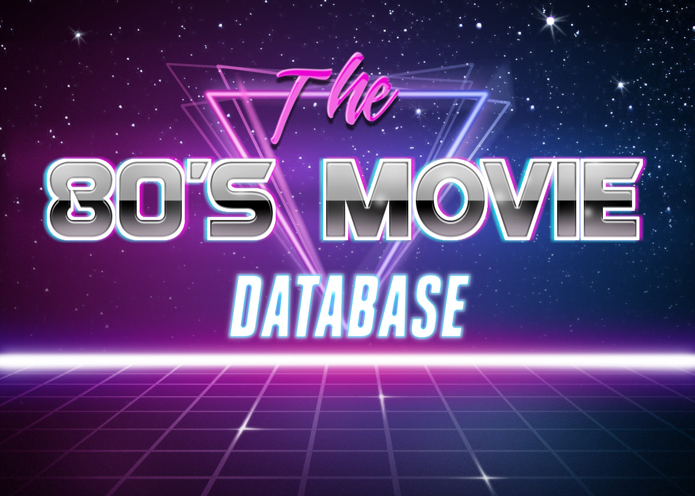

# The Eighties Movie Database

A sample project demonstrating a GraphQL API using Elixir + Phoenix + Absinthe.

See [The Playbook](playbook.md) for the script used in the presentation.

Also see [The Slides](https://docs.google.com/presentation/d/14Oi-DJdCSX6vfC8mIdCqt5mMgHg7y02AgTV1SJUflCQ/edit?usp=sharing).

To start the EMDB Phoenix server:

* Install dependencies with `mix deps.get`
* Create and migrate your database with `mix ecto.setup`
* Start Phoenix endpoint with `mix phx.server`

Now you can visit [`localhost:4000`](http://localhost:4000) from your browser.
